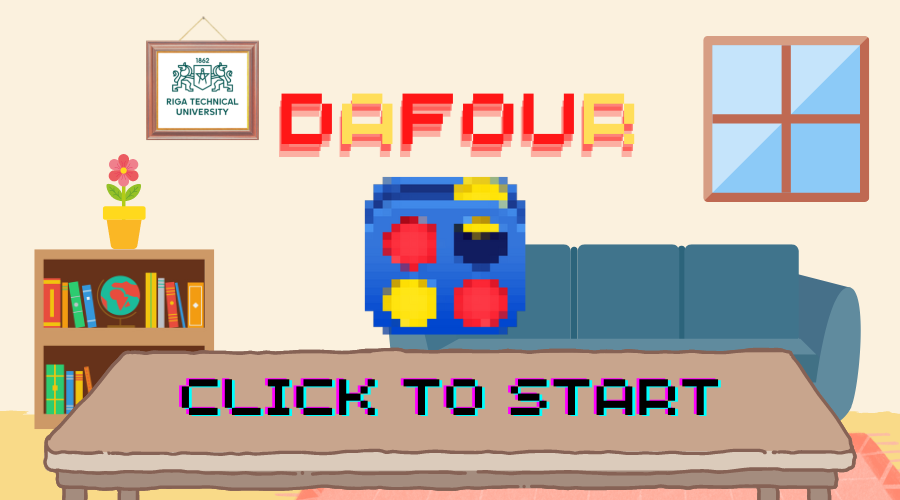

## DAfour
Development of a Connect 4 Game software for the Applied System Software course at the Riga University of Technology (RTU)

### Link for the report:
[Link](https://docs.google.com/document/d/1wj8dWIFPc39VEJFcaQ2we9zuJyPB9k3uuMuU6C9DiXs/edit?usp=sharing) for the report

### Group Members
- Victor Demessance - 230ADB010
- Artur Henrique Allen Santos - 230ADB012
- Sevda Imanigheshlaghchaei - 230ADB033
- Ahmad Foroughi - 230ADB034

## User Manual

The first thing to do is to click on the screen to start the game. The user has the choice to click on any part of the screen.

The user arrives on the game screen. He can move the mouse to see directly the position of the piece he is going to play. Moreover, he can see the color of the piece thanks to the preview at the top of the board. Finally, the user can choose to click on the reset button to restart the game on the start screen.

As the game progresses, the cells on the board fill up. If a move is victorious, the screen refreshes showing the winner (1 for the red player, always starting, and 2 for the yellow). The user can then look at the board to check this but cannot play any more. Finally, he can press the reset button to return to the start screen.

